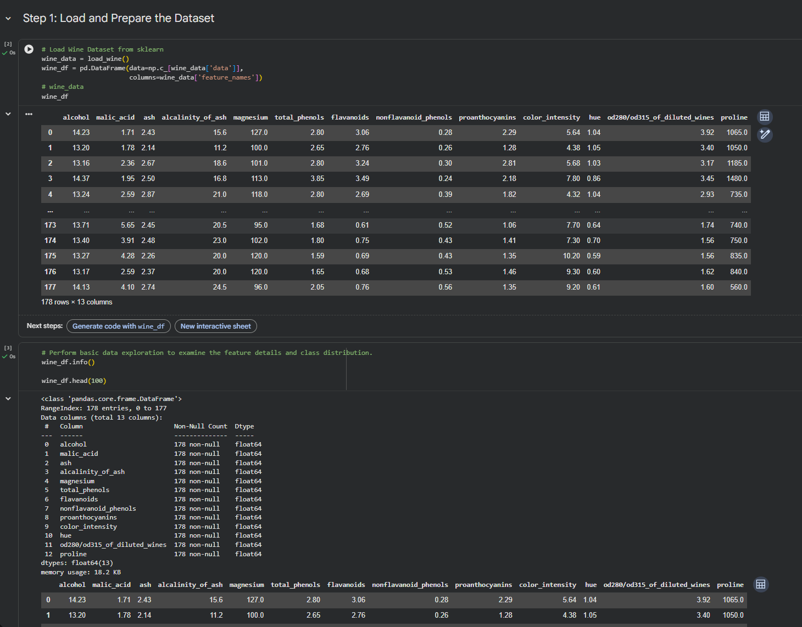
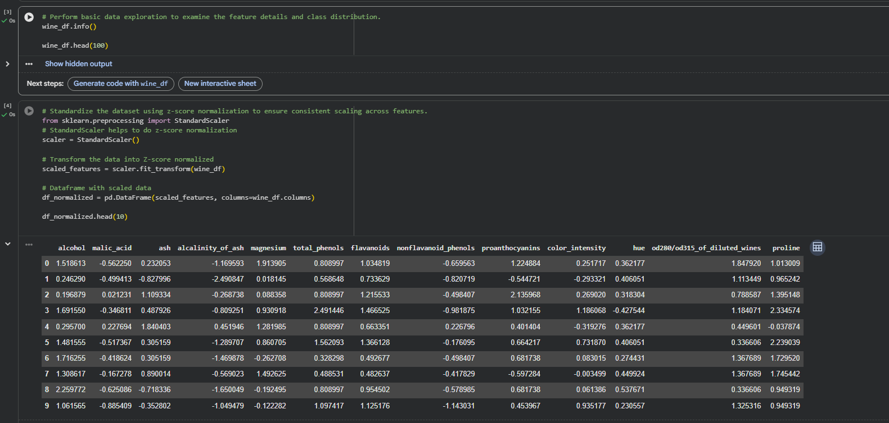
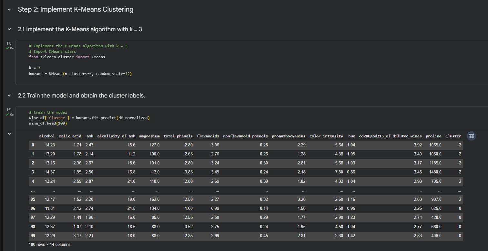
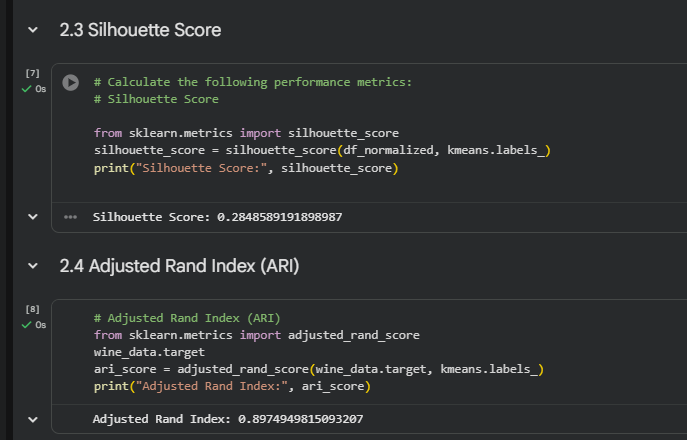
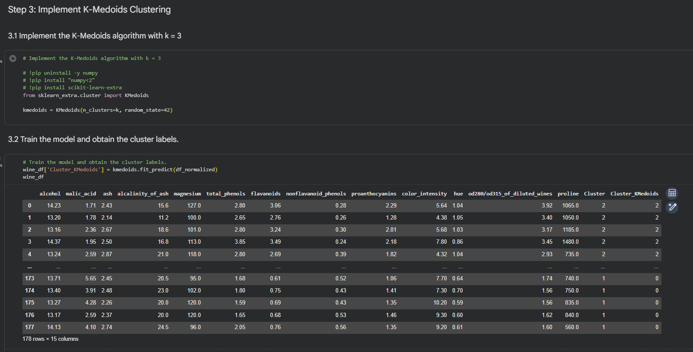
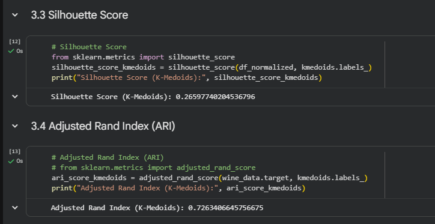
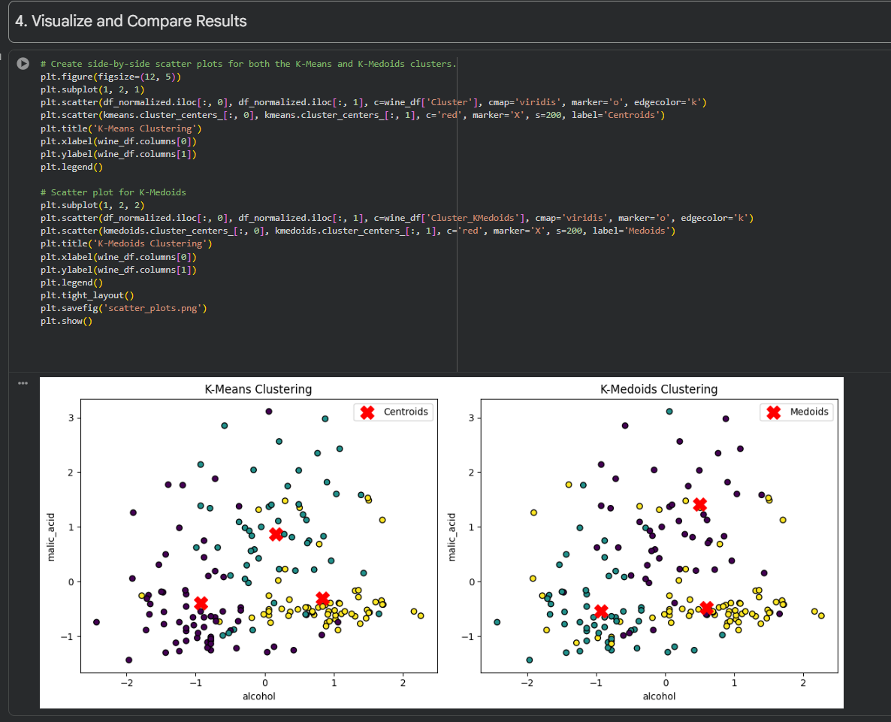
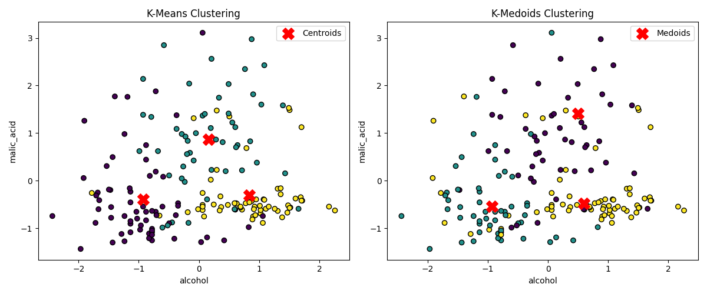

# MSCS 634 - Lab 3: Clustering Analysis on Wine Dataset

## Purpose

In this lab, I applied two clustering algorithms -- **K-Means** and **K-Medoids** -- on the Wine dataset from sklearn to understand how unsupervised clustering works and how different methods compare. The Wine dataset contains 178 samples with 13 chemical features across three wine cultivars. The goal was to cluster the data with k=3, visualize the results, and evaluate clustering quality using the Silhouette Score and Adjusted Rand Index (ARI).

## Notebook Screenshots

### Step 1: Load and Explore the Dataset

### Step 1: Z-Score Normalization

### Step 2: K-Means Clustering (k=3)

### Step 2: K-Means Silhouette Score and ARI

### Step 3: K-Medoids Clustering (k=3)

### Step 3: K-Medoids Silhouette Score and ARI

### Step 4: Side-by-Side Visualizations

## Key Insights from Clustering Results

### Performance Metrics

| Metric | K-Means | K-Medoids |
|--------|---------|-----------|
| Silhouette Score | 0.285 | 0.266 |
| Adjusted Rand Index (ARI) | 0.897 | 0.726 |

- K-Means outperformed K-Medoids on both metrics for this dataset. The higher ARI (0.897) means K-Means clusters aligned much more closely with the actual wine classes compared to K-Medoids (0.726).
- The Silhouette Scores for both methods are moderate, which suggests there is some overlap between clusters in the high-dimensional feature space. This is expected since wine characteristics can be similar across cultivars.

### Comparison and Analysis

- **Which algorithm produced better-defined clusters?** K-Means produced better-defined clusters based on both the Silhouette Score and ARI. This is because K-Means minimizes the sum of squared distances to the centroid (mean of all points), which works really well when clusters are roughly spherical and evenly sized. The Wine dataset, after z-score normalization, fits this scenario well since the features follow approximately normal distributions without heavy skew. As a result, K-Means was able to find centroids that sit close to the true center of each wine class, leading to a high ARI of 0.897.

- **Differences in cluster shapes or positioning:** From the scatter plots, both algorithms produce visually similar groupings when projected onto alcohol vs. malic acid. However, K-Means had slightly tighter cluster boundaries because it computes centroids as the mean of all assigned points, which naturally pulls the center toward the densest region of the cluster. K-Medoids, on the other hand, is restricted to picking an actual data point as the center (medoid), so the medoid might not sit at the optimal geometric center. This constraint caused some boundary points to be assigned differently, resulting in slightly less compact clusters and the lower Silhouette Score (0.266 vs 0.285).

- **When to prefer each algorithm:** K-Means is the better choice when the data is clean, roughly spherical, and free of significant outliers -- like the Wine dataset used here. Since K-Means uses the mean to compute centroids, even a few extreme values can pull the centroid away from the true cluster center. K-Medoids avoids this problem because it selects an actual data point as the center, so a single outlier can't shift the medoid as drastically. For datasets with noise, non-standard distance metrics, or outlier-heavy distributions, K-Medoids would be the more reliable option even if it comes with higher computational cost.

### Clustering Visualizations

The scatter plots below show K-Means (left) and K-Medoids (right) clustering results projected onto the first two features (alcohol vs. malic acid). Red X markers represent the centroids and medoids respectively.

## Challenges and Decisions

- **K-Medoids Setup:** Implementing K-Medoids required the `scikit-learn-extra` package, which had some compatibility issues with newer NumPy versions. I had to install a compatible NumPy version to get it working.
- **Evaluation Approach:** I used both Silhouette Score and ARI to get a more complete picture. Silhouette Score evaluates cluster quality without needing ground truth labels, while ARI measures how well the clusters match the actual wine classes. Using both gives a better understanding of clustering performance from different angles.
